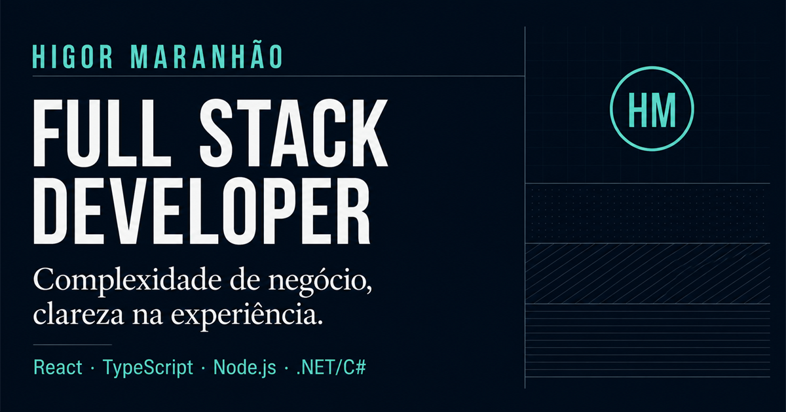

# Higor Maranhão — Portfólio

<p align="center">
  <a href="https://higormn.github.io/">
    
  </a>
</p>

Portfólio profissional de **Higor Maranhão Nunes**, Full Stack Developer com foco em React, TypeScript, Node.js, .NET/C# e produtos SaaS/ERP.

[Acessar o site](https://higormn.github.io/) · [LinkedIn](https://www.linkedin.com/in/higor-maranhao/) · [GitHub](https://github.com/HigorMN)

## Sobre o projeto

O site foi pensado para comunicar experiência profissional com clareza e permitir uma leitura rápida por recrutadores, lideranças técnicas e times de produto. A arquitetura é uma página única: todo o conteúdo relevante permanece acessível por âncoras, sem roteamento ou estado desnecessários.

Principais decisões:

- Hierarquia editorial e navegação curta.
- Experiência profissional apresentada como contexto de produto.
- Curadoria de projetos públicos, em vez de uma galeria extensa.
- Conteúdo separado da camada visual e tipado com TypeScript.
- HTML semântico, skip link, foco visível e suporte a movimento reduzido.
- Metadados completos para SEO e compartilhamento social.
- Redirecionamento das antigas URLs para as novas seções.
- Zero dependências de UI ou animação em runtime.

## Stack

| Área       | Tecnologia                            |
| ---------- | ------------------------------------- |
| Interface  | React 19 + TypeScript                 |
| Build      | Vite                                  |
| Estilos    | CSS responsivo com custom properties  |
| Qualidade  | ESLint + Prettier + TypeScript strict |
| Testes     | Vitest + Testing Library              |
| Publicação | GitHub Pages                          |

## Estrutura

```text
src/
├── components/         # Elementos reutilizáveis e acessíveis
├── sections/           # Seções independentes da página
├── content/
│   └── portfolio.ts   # Conteúdo e contratos tipados
├── test/
│   └── setup.ts       # Ambiente de testes
├── App.test.tsx       # Jornadas essenciais
├── App.tsx            # Composição semântica da página
├── main.tsx           # Entrada da aplicação
└── styles.css         # Sistema visual e responsividade

public/
├── 404.html           # Compatibilidade com URLs antigas
├── og.png             # Preview para redes sociais
├── robots.txt
└── sitemap.xml
```

## Desenvolvimento

Requer Node.js `20.19` ou superior.

```bash
npm install
npm run dev
```

## Qualidade

O comando abaixo executa lint, testes, checagem de tipos e build de produção:

```bash
npm run validate
```

Comandos individuais:

```bash
npm run lint
npm run test
npm run build
```

## Publicação

O projeto mantém o fluxo do GitHub Pages:

```bash
npm run deploy
```

O build de produção é gerado em `dist/` e publicado na branch configurada pelo pacote `gh-pages`.

## Conteúdo profissional

Informações sobre produtos internos foram descritas apenas no nível necessário para explicar contexto, responsabilidades e decisões de engenharia. Nenhum código, dado ou interface proprietária é exposto neste repositório.
